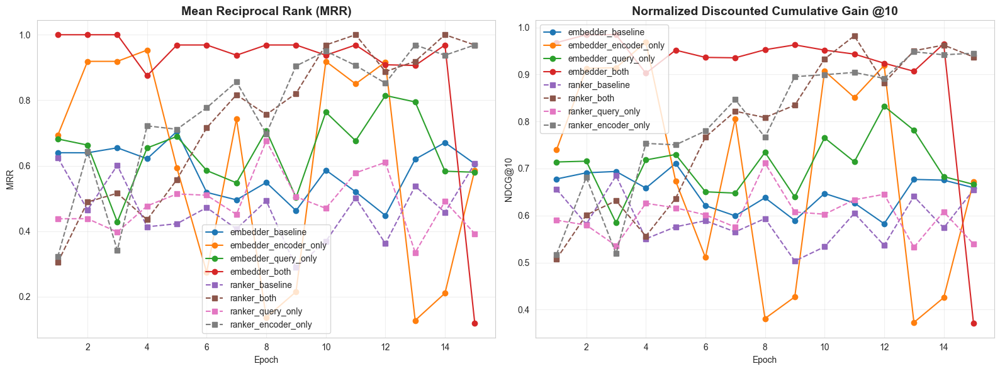

# TR-ACE: Trained Retrieval with Adaptive Chunk Encoding

Neural ranking system for retrieving relevant document sections using learnable query embeddings.

## Problem

Generic embedding models (OpenAI, Cohere, etc.) struggle with domain-specific retrieval tasks:
- Naïve embeddings don't adapt to specialized document structures
- API-based models require per-query inference costs
- Self-hosting large models (7B+) is resource-intensive

# Solution: Learning a task-specific ranking without explicit queries

**Learnable Query:** Instead of encoding a user's query at inference time, it has a single learnable query_embedding parameter that gets optimized during training

**Use Case**: Retrieve specific sections (e.g., "Award Criteria", "Technical Requirements") from structured documents where:
- Section types are known and fixed
- Retrieval patterns are consistent
- Low-latency, cost-effective inference is required

## Quick Start

```bash
# Install
pip install -r requirements.txt

# Train
python train.py

# Evaluate
python evaluate.py
```

## Architecture

- **Model**: Fixed DistilBERT-based ranker with learnable query embedding
- **Input**: Document chunks (tokenized text)
- **Output**: Relevance scores for ranking
- **Loss**: Binary Cross-Entropy
- **Training**: 2 positives + 8 negatives per document

## Configuration

Edit `train.py`:

```python
@dataclass
class TrainingConfig:
    category: str = "Category of the summary text to train embedding on"
    model_name: str = "distilbert-base-uncased"
    batch_size: int = 2
    num_epochs: int = 5
    learning_rate: float = 1e-4
    max_length: int = 256
    initial_query: str = "your initial na�ve query"
    num_positives_per_tender: int = 2
    num_negatives_per_positive: int = 4
```

## Metrics

**Batch-level (sampled chunks):**
- Precision@1: Top chunk is positive
- MRR: Reciprocal rank of first positive
- NDCG@10: Ranking quality in top-10

**Full-document (realistic retrieval):**
- Recall@K: % of positives captured in top-K
  - Example: 3 positives total, 2 in top-10 � Recall@10 = 0.67


**Interpretation**: Retrieving top-10 chunks captures 79% of relevant sections. Top-20 captures 90%.

## Data Format

**Preprocessed document JSON:**
```json
{
  "tender_id": "12345",
  "chunks": [
    {
      "text": "...",
      "metadata": {"chunk_id": "12345_0", "section": "..."}
    }
  ],
  "positives": ["12345_5", "12345_12"]
}
```

## Experimental Results

### Setup

We tested multiple architectures to validate the learnable query approach:

- **Ranker models**: DistilBERT-base-uncased with learnable query
- **Embedder models**: sentence-transformers/all-MiniLM-L6-v2 with learnable query
- **Configurations**:
  - `baseline`: Pre-trained model without fine-tuning
  - `encoder_only`: Fine-tune only the encoder, freeze query
  - `query_only`: Fine-tune only the query embedding, freeze encoder
  - `both`: Fine-tune both encoder and query embedding

### Key Results

| Model | Recall@20 | Behavior |
|-------|-----------|----------|
| ranker_both (DistilBERT) | ~90% | Steady improvement, stable |
| ranker_encoder_only | ~90% | Similar to ranker_both |
| embedder_both (MiniLM) | ~90% | Immediate jump, very stable |
| embedder_baseline | ~60% | Stable but mediocre |
| embedder_encoder_only | 10-90% | **Catastrophic oscillation after 3 epochs** |




### Findings

1. Task-specific fine-tuning with a learnable query achieves **90% Recall@20**, beating the 60% baseline of pre-trained sentence transformers.

2. **Training instability in all-MiniLM-L6-v2**: Noticed all-MiniLM-L6-v2 is fragile to partial fine-tuning. Training only the encoder causes catastrophic failure, presumably from representation space misalignment - the frozen query becomes incompatible with the adapted encoder space and tries to overfit.

4. **Both components need training**: Query-only training completely fails after a certain number of epochs. The encoder adaptation helps to keep the training stable and converges faster after one epoch.
